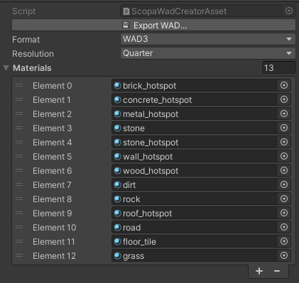

# WAD Exporter / Creator

Scopa can export texture .WAD files, bundling a list of Unity materials together into a new texture WAD. 

Use this to generate some low resolution preview textures for use in TrenchBroom.

## How to create a WAD

1. In Unity's Project tab, use `Create > Scopa > Wad Creator`
2. Select the new Scopa Wad Creator file.
3. In Unity's Inspector tab, add at least one material to the wad creator's Materials list.
4. Click the Export WAD button.

## WAD Creator settings

**Export WAD**: click this button to save a .WAD file based on the current settings
- You should save the .WAD file *outside* of the /Assets/ folder.

**Format**: (default: WAD3) what kind of WAD file to generate
- only Half-Life WAD3 is supported for now

**Resolution**: (default: Quarter) how much smaller to downscale each WAD texture
- e.g. if your Unity textures are 1024x1024, then Quarter (x 0.25) resolution = 256x256
- we recommend Quarter resolution by default, since WADs can get pretty big at large resolutions
- you probably don't want to load anything bigger than a 1024x1024 WAD texture into TrenchBroom

**Materials**: list of all the Unity materials to convert and package into the WAD, drag and drop
- Each WAD texture name will be based on the Material name.
- To fit the WAD format, all names will be converted to **all lowercase, spaces removed, the first 15 characters at most.**
- If there's already a WAD texture with the same name, we will try to add numbers (0-9) and letters (a-z) to increment.
- Renamed textures will be noted in a Unity Editor Debug.Log console message after export.

## WAD texture conversion process

The Scopa Wad Creator follows this process **for each material in its Materials list**:

1. Read the [`Material.mainTexture`](https://docs.unity3d.com/ScriptReference/Material-mainTexture.html)
2. Tint it with [`Material.color`](https://docs.unity3d.com/ScriptReference/Material-color.html)
3. Palettize the tinted texture to 256 colors. 
    - If using Quake WAD2 format, use the Quake palette (which is in public domain).
    - (recommended) If using Half-Life WAD3 format, generate a unique per-texture 256 color palette using median cut quantization.
4. Use GPU to match each pixel to its nearest palette entry and generate mipmaps.
5. Transparent alpha textures will be masked with color palette index 255. (Quake 255 is pink, Half-Life 255 is blue.)
6. Write out the WAD data lump bytes.

