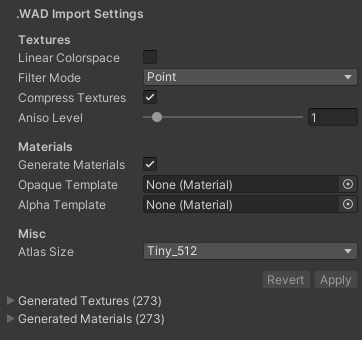

# WAD Importer

Scopa can import texture .WAD files, generating textures and materials for use in Unity.

## How to import WADs

1. Put a .WAD file somewhere in Assets folder.
2. Unity will automatically detect the file and import it.

***

## WAD Importer settings

## Textures

**Linear Colorspace**: (default: false) WAD textures are more 'correct' in default Gamma sRGB color space, but you may prefer the washed-out look of importing them as Linear textures.

**Filter Mode**: (default: Point) For a retro pixel art look, use Point. For a modern smoother look, use Bilinear or Trilinear.

**Compress Textures**: (default: true) Compression saves memory but adds noise and longer import times. Good for most textures, bad for subtle gradients. But honestly, the chances are that any WAD compression has already trashed any subtle gradients.

**Aniso Level**: (default: 1) Anisotropic filtering spends more GPU time to make textures slightly less blurry at grazing angles. Often used for ground textures. NOTE: Setting this to 0 means the texture will never use aniso, even if you Force Aniso on in the Quality Settings.

## Materials

**Generate Materials**: (default: true) If enabled, Scopa will generate a Material for each texture.

**Opaque Template**, **Alpha Template**: (optional) override the templates that Scopa uses to generate Materials, otherwise Scopa will default to built-in Standard shader.
- Opaque Template is used for most textures, Alpha Template is used if the WAD texture uses color index 255 (reserved for transparency).
- Definitely override this if you're not using Standard built-in shaders, for SRPs like URP or HDRP. 
- Make sure the template material's shader has a `_MainTex` property (or use the `[MainTexture]` attribute), otherwise Scopa won't be able to slot in the texture, and the materials will be blank.

## Misc

**Atlas Size**: (default: Tiny 512x512) maximum size of the preview atlas texture for the entire WAD, as seen in the inspector. 
- Only for editor use! Don't use this in-game, because Unity might pack the preview atlas differently upon reimport.

**Generated Textures**: giant read-only array of all the generated texture bitmaps, for debugging purposes

**Generated Materials**: giant read-only array of all the generated materials, for debugging purposes

***

## Supported WAD formats

Note that we only support Quake WAD2 or Half-Life WAD3 formats, and we import textures in only two ways: opaque or alpha cutout transparency. 

(For now, fullbright pixels and emissive textures are also treated like plain materials.)

Special texture name prefixes are ignored. For example, prefixes like +0, +a, *, {, etc. are all ignored.

## Technical details

Like any other complex asset in Unity, here the generated textures and materials are stored as virtual read-only "sub-assets". They are not stored as individual files in the Assets folder. We do this to (1) avoid utter chaos and (2) preserve the WAD file as the single source of truth.

Of course, this doesn't stop you from making custom materials that use the WAD textures, etc.

