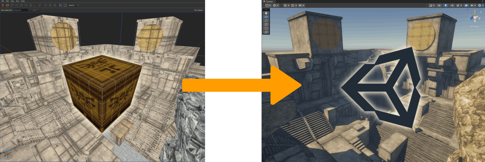
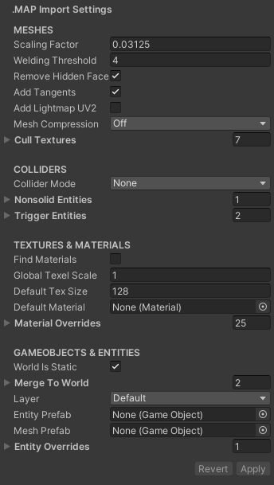

# Scopa

*Scopa* ("broom" in Latin) is a Unity level design plugin that adds support for various Quake / Half-Life / Source map file formats. Like [func_godot](https://github.com/func-godot/func_godot_plugin) but for Unity. To build levels, we strongly recommend [TrenchBroom](https://github.com/TrenchBroom/TrenchBroom).

# WARNING: in unstable early development, not ready for production use yet, might change a lot or break

- [MAP, RMF, VMF, JMF import](Documentation~/MapImporter.md) generates model prefab with meshes, colliders, entities. (note: only core Q1 MAP features)
- [WAD import](Documentation~/WadImporter.md) / [WAD export](Documentation~/WadExporter.md) (Quake 1 WAD2 / Half-Life WAD3 textures format, not Doom)
- FGD creator can export entity definitions out to TrenchBroom
- works at editor time or runtime (for modding support)

## Installation

This is a [Unity Package](https://docs.unity3d.com/Manual/PackagesList.html) for Unity 2022.3 or later. To install, open [Package Manager](https://docs.unity3d.com/Manual/upm-ui.html) and add `https://github.com/radiatoryang/scopa.git` [(more info and help)](https://docs.unity3d.com/2022.3/Documentation/Manual/upm-ui-giturl.html)

Dependencies: [Burst](https://docs.unity3d.com/Packages/com.unity.burst@latest/), [Unity.Collections](https://docs.unity3d.com/Packages/com.unity.collections@latest/), and [Unity.Mathematics](https://docs.unity3d.com/Packages/com.unity.mathematics@latest). These are already required for URP anyway.

## Usage

Put a supported file (MAP, RMF, VMF, JMF, WAD) in your `/Assets/` folder and it'll import automatically, just like any other asset file. Defaults are tuned to typical Quake / Half-Life [level design metrics](https://book.leveldesignbook.com/process/blockout/metrics), 32 map units = 1 Unity meter.

**Do your edits in the level editor, not in Unity!** Any in-editor changes may be erased when you re-import the .MAP again. Treat the .MAP file as the [single source of truth](https://en.wikipedia.org/wiki/Single_source_of_truth). 

For more info, see [Documentation](Documentation~/Index.md).

## Limitations

**This package doesn't have game code.** It just imports and exports files. You still have to make the game yourself.

**We treat the Quake 1 Trenchbroom .MAP v220 file format as the core feature set. Anything beyond these core features (brushes and entity keyvalue pairs) is not supported.** For more info, see the [Map Importer docs](Documentation~/MapImporter.md).

## Contributions

- Issues currently ARE NOT ACCEPTED at this time. Development is still very early.
- Pull Requests ARE ACCEPTED if you know what you're doing / it can be merged easily / it's not a major feature that I'll have to maintain.

## Acknowledgments / Credits

- lots of file format handling from [Sledge Formats](https://github.com/LogicAndTrick/sledge-formats)
- GPU-based texture resizing from [Unity GPU Texture Resize](https://github.com/ababilinski/unity-gpu-texture-resize)
- color palette generation from [JeremyAnsel.ColorQuant](https://github.com/JeremyAnsel/JeremyAnsel.ColorQuant), an implementation of Xiaolin Wu's Color Quantizer (v2) from Graphics Gems volume II
- mesh normal smoothing from [Ica_Normal_Tools](https://github.com/Ica-Software/Ica_Normal_Tools/)

## Advice
- I prefer more control, but if you want to pay for something simpler with magic auto configuration then try [Tremble Map Importer (Asset Store)](https://assetstore.unity.com/packages/tools/level-design/tremble-map-importer-277805)
- looking for a BSP plugin? try [Unity3D BSP Importer](https://github.com/wfowler1/Unity3D-BSP-Importer)
